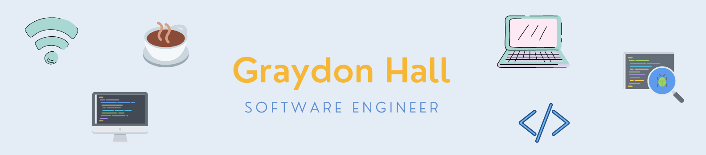

### Welcome to my page! 👋
My name is Graydon Hall, and I'm from Calgary, AB, Canada 🍁. 
I have 3 years of experience working as a full-stack software developer, most recently with PHP (Laravel), and Vue.js. 

I have a BSc. in Mechanical Engineering ⚙️
along with a Masters in Software Engineering 💻 

### Technologies and Skills 👨‍💻

    
    
    
    
    
    
    
    
    
    
    
    
    

### Contact Me ☎️️

 
     

